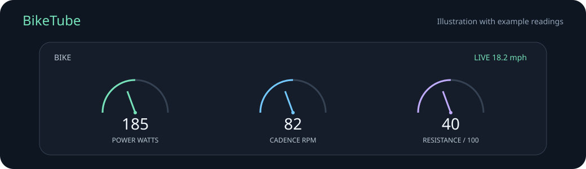

# BikeTube

BikeTube lets you watch YouTube on a Peloton Bike with a floating display of estimated speed, cadence, power, and resistance. It includes a Home screen with buttons for BikeTube and the original Peloton app.

BikeTube reads the tablet's existing sensor service. It does not require a Peloton subscription, root access, or firmware changes. Compatibility depends on the tablet and software version.

## Compatibility

| Device | Status |
| --- | --- |
| Bike tablets with Android 11 or newer and the V1 sensor interface | Supported interface; the installer defaults to the RB1VQ model family |
| Other Bike tablets or firmware versions | Unverified |
| Bike+ | Unverified; its sensor interface differs, and this app implements only V1 |
| Android 10 or earlier, Tread, Row | Not supported |

Speed is estimated from power using the community-derived Peloton speed model. It is not measured road speed, and exact agreement with the stock Peloton display has not been verified. App installation and sensor access can change with Peloton updates.

## Build and install

You need a computer, a USB data cable, Python 3, and Android development tools. Android Studio provides the Android SDK and a Java runtime. Use JDK 17 and install SDK Platform 34, Build Tools 34.0.0, and Platform Tools from its SDK Manager.

1. Download or clone this repository and open it in Android Studio. Let it finish importing the project. The included Gradle wrapper also supports command line builds.
2. On the bike, open Android Settings, then About tablet. Tap Build number seven times. Open Developer options and enable USB debugging. Connect the USB cable and accept the computer authorization prompt.
3. Build the app and check the connected bike using the commands below.
4. Install with `--launcher` to make BikeTube the Home screen. Omit that option to leave the existing Home screen in place.

On macOS or Linux:

```sh
./gradlew assembleDebug testDebugUnitTest lintDebug
python3 scripts/device.py doctor
python3 scripts/device.py install --launcher
```

On Windows PowerShell:

```powershell
.\gradlew.bat assembleDebug testDebugUnitTest lintDebug
python scripts/device.py doctor
python scripts/device.py install --launcher
```

If `adb` is not on your PATH, provide its path before the command:

```sh
python3 scripts/device.py --adb /path/to/platform-tools/adb install --launcher
```

If multiple Android devices are connected, provide `--serial SERIAL` before the command. The installer refuses to choose a device automatically in that situation.

The installer saves the previous Home app in `.biketube-state.json` before changing Home. Keep that local file for restoration. The installer also grants floating display permission. No subscription purchase, factory reset, bootloader change, or firmware patch is part of setup.

For complete instructions, see [Setup](docs/setup.md) and [Troubleshooting](docs/troubleshooting.md).

## Use the app



The illustration uses example readings. It contains no account or device data.

Press the Peloton Home button and choose BikeTube. Search using the native search box at the top, then choose a video. The video has a visible Exit fullscreen control even when the metrics panel is hidden.

Drag the BIKE header to move the panel. The bottom dashboard uses animated analog gauges for power, cadence, and resistance. Collapse shows speed alone, and Gauges restores the dials. The power dial spans 0–500 W, cadence 0–160 rpm, and resistance 0–100. Numeric readings continue beyond the dial scale. Position and display mode are remembered. Open Settings to choose mph or km/h or reset the panel position.

The metrics panel shows missing readings as a dash after three seconds without a fresh frame. It never changes resistance or calibration. Videos need Wi-Fi, while the sensor connection runs locally on the tablet. No computer or USB cable is needed during use.

The app starts metrics while the viewer is open if display permission is granted. If you installed the APK manually, tap Show metrics to open the Android permission screen, allow BikeTube to display over other apps, and return to the viewer.

## Update, restore, or uninstall

Build future updates with the same signing key, then run the install command again. An Android Studio debug key is local to the computer. APKs built on another computer or CI runner can have a different key and cannot replace an existing install without uninstalling it first.

```sh
python3 scripts/device.py install --launcher
python3 scripts/device.py restore-home
python3 scripts/device.py uninstall
```

`restore-home` leaves BikeTube installed. `uninstall` restores the previous Home app first if BikeTube is currently Home, and stops if restoration cannot be verified. Uninstalling deletes local settings and website cookies.

## Development and distribution

The repository contains the app source, a standard Gradle build, installer scripts, unit tests, and a GitHub Actions build. It contains no Peloton APKs, firmware, decompiled software, device logs, or private signing keys.

The APK uses the original package ID `local.peloton.probe` so existing prototype installations can be updated. The user-facing name is BikeTube. Builds are intended for direct installation through USB, not Google Play.

See [Development](docs/development.md), [Validation](docs/validation.md), and [Contributing](CONTRIBUTING.md). Automated tests check calculations and setup behavior. They do not prove compatibility with a different bike.

To create a source archive for sharing, run `python3 scripts/package_source.py`. The archive includes only the public project files, not local tools, APKs, setup state, or signing keys.

BikeTube stores its display preferences and YouTube website data locally. It has no developer analytics or server. YouTube requests go to YouTube and its content providers. See [Privacy](docs/privacy.md).

## Credits and license

The power to speed model was derived by [Imran Haque in PeloMon](https://ihaque.org/posts/2020/12/25/pelomon-part-ib-computing-speed/). The Java calculation is adapted from [OpenRide](https://github.com/digitalducktape/OpenRide). [Grupetto](https://github.com/selalipop/grupetto) demonstrated the sensor overlay approach.

BikeTube is distributed under the [Apache License 2.0](LICENSE). Attribution is retained in [NOTICE](NOTICE). BikeTube is an independent project and is not affiliated with Peloton or YouTube.
